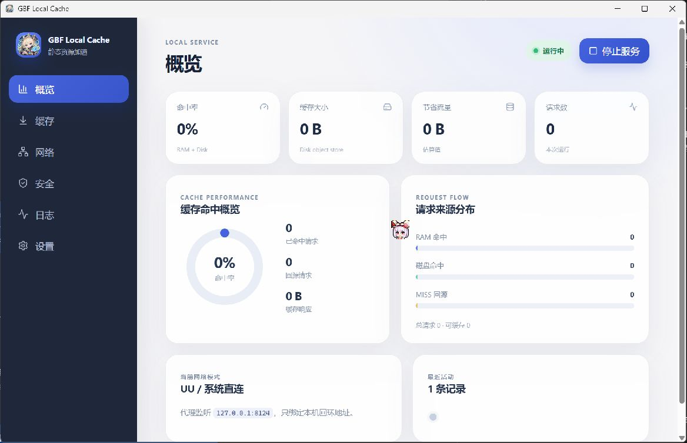
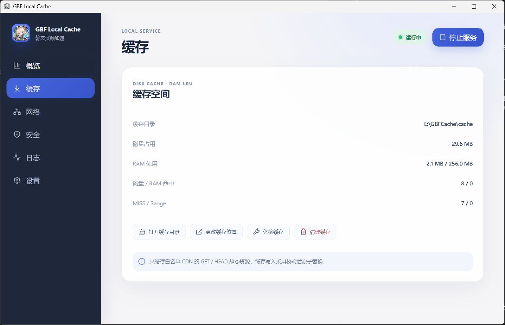
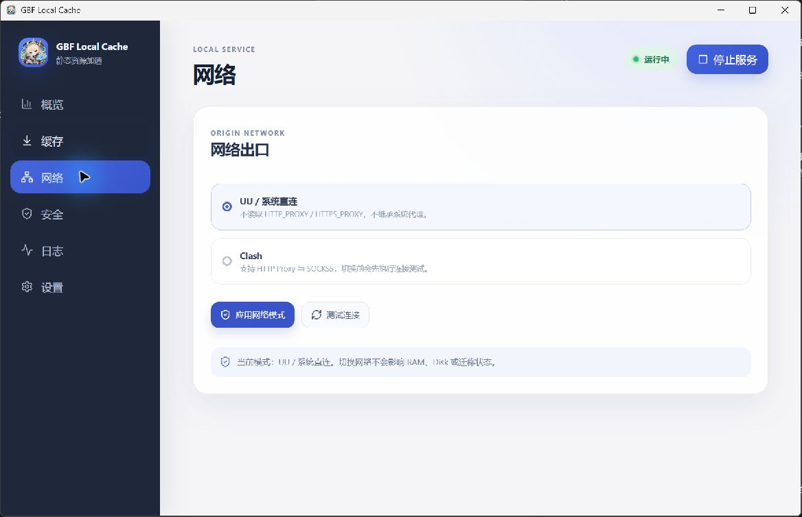
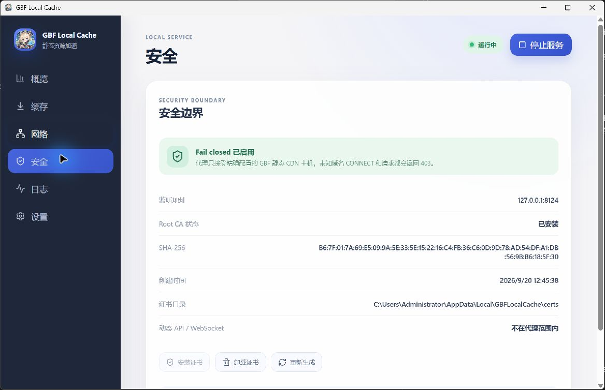
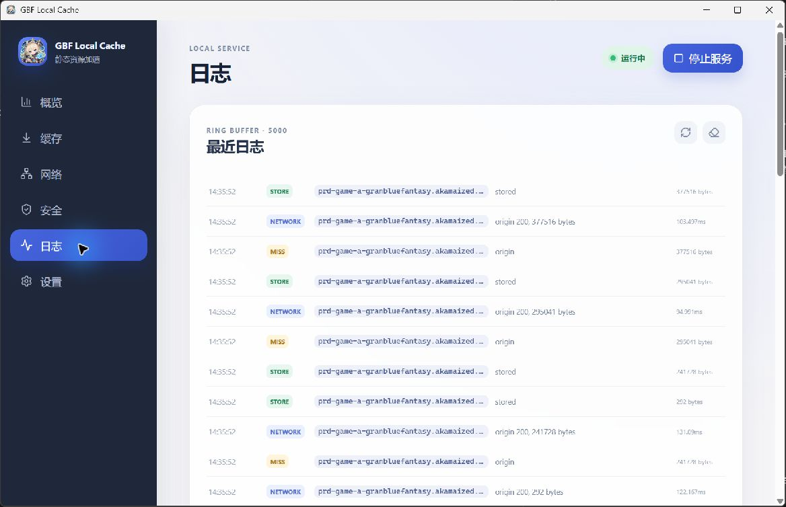
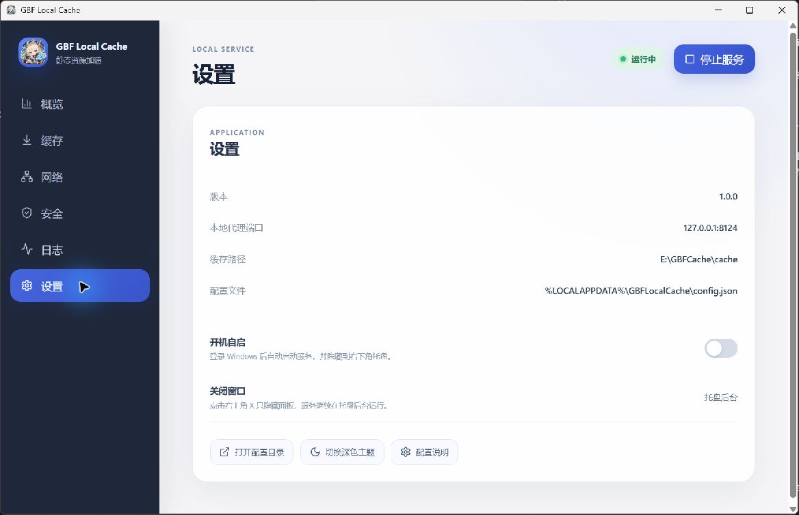

<p align="center">
  
</p>

<h1 align="center">GBF Local Cache</h1>

<p align="center">面向 Granblue Fantasy 静态 CDN 的 Windows 本地缓存代理。</p>

## 功能

- 精确白名单代理 `prd-game-a-granbluefantasy.akamaized.net`。
- HTTP GET/HEAD、HTTPS CONNECT 与本地 TLS MITM。
- RAM LRU + 磁盘对象缓存，支持 ETag、Last-Modified、304、Range 和 HEAD。
- Direct / Clash HTTP / SOCKS5 上游网络模式。
- Root CA 生成、安装、卸载和重新生成。
- 缓存体检、清理、跨盘迁移、迁移恢复与暂停/继续/取消。
- 命中率、请求来源、磁盘占用和实时日志可视化。
- Windows 系统托盘、关闭窗口后台运行、当前用户开机自启。
- Fail-closed：非白名单域名、动态 API、WebSocket 和非静态请求不会经过本程序。

## 使用

启动 `gbf-local-cache.exe` 后：

1. 在“安全”页面安装 Root CA。
2. 在 ZeroOmega 中创建 HTTP 代理：

   ```text
   地址：127.0.0.1
   端口：8124
   ```

   端口可在“设置”中修改；修改后请将 ZeroOmega 的端口同步为相同值。

3. 添加域名规则，将以下域名指向该代理：

   ```text
   prd-game-a-granbluefantasy.akamaized.net
   ```

4. 进入游戏并刷新页面。日志出现 `MISS`、`NETWORK`、`STORE` 或 `HIT` 即表示代理和缓存链路生效。

程序只处理白名单内的静态 CDN 资源；登录、动态 API、战斗、抽卡、结算和 WebSocket 保持直连。

默认点击窗口关闭按钮会隐藏到系统托盘，服务继续运行；也可在“设置”中改为关闭窗口时退出程序。右键托盘图标可以重新打开控制面板或退出程序。“设置”中可启用当前用户开机自启。

## 界面

<p align="center">
  
</p>
<p align="center">
  
  
</p>
<p align="center">
  
  
</p>
<p align="center">
  
</p>

## 构建

环境要求：

- Windows 10/11
- Go 1.24.x
- Node.js 18+ / npm
- Wails v2.10.2
- WebView2 Runtime

PowerShell：

```powershell
cd C:\code\Gbf-Cache
$env:Path = "C:\code\go-toolchain-1.24\go\bin;C:\Users\Administrator\go\bin;$env:Path"

cd frontend
npm install
npm run build
cd ..

go test ./...
go vet ./...
wails build -clean
```

Windows 成品输出到：

```text
build\bin\gbf-local-cache.exe
```

## 数据目录

```text
%LOCALAPPDATA%\GBFLocalCache\config.json
%LOCALAPPDATA%\GBFLocalCache\cache\
%LOCALAPPDATA%\GBFLocalCache\certs\
```

默认监听地址为 `127.0.0.1:8124`，仅接受本机连接。
